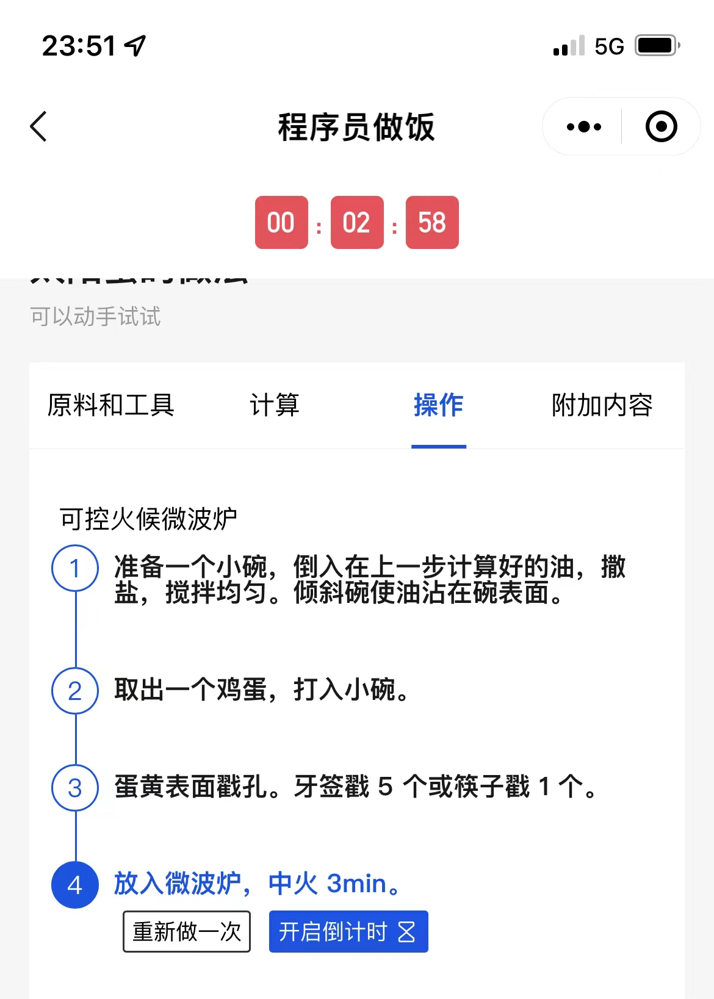
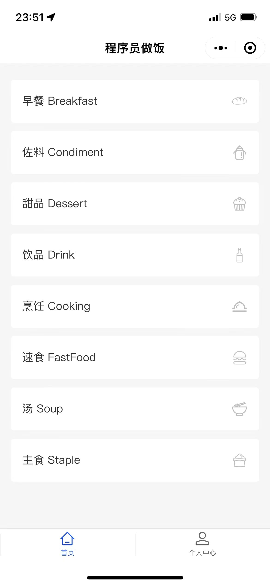
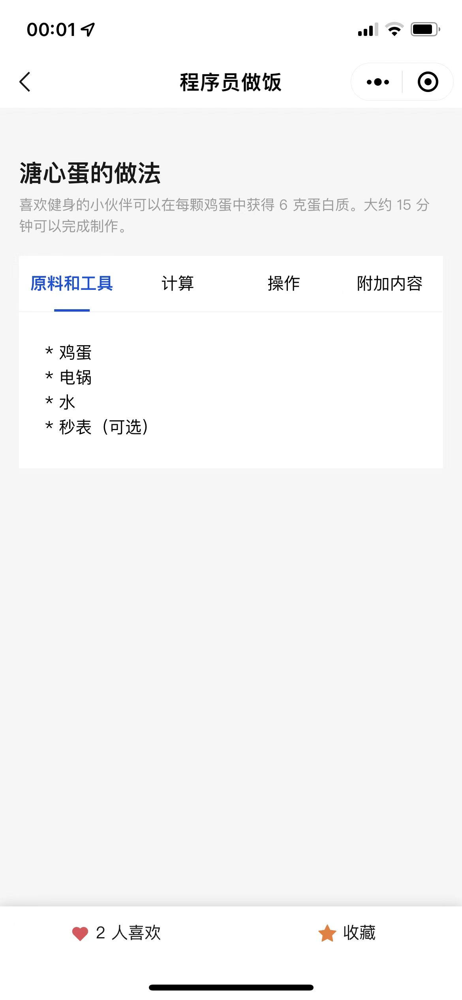
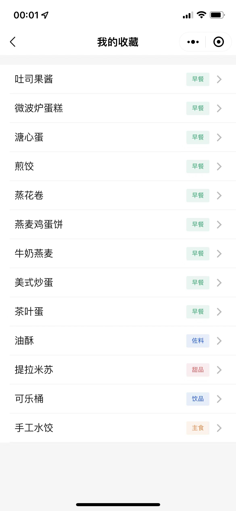

# HowToCookOnMiniprogram

小程序版本 **程序员做菜指南**，将程序员精神贯彻到底

灵感和数据来源于 [HowToCook](https://github.com/Anduin2017/HowToCook)

## 微创新

### 内嵌计时器 ⌛️

有些步骤会存在计时的需求，当前做到识别时间，并可以内嵌计时器

### 可视化分类 😊

简洁、美观

### 收藏 & 点赞 👍

方便快速找回常用的菜谱

## 如何贡献

- 源代码位于 miniprogram 目录
- 解析 markdown 菜谱的脚本位于 `srcipt/index.js`; 对应命令: `npm run gen-data`
> 目前比较简陋，为了快速上线，后续将优化一下

## 后续更新

### v1.0.0

- [x] 增加个人收藏 (v0.2.0)
- [ ] 解析并展示 MarkDown 的图片资源、各种格式
- [ ] 增加【厨房准备】模块
- [ ] 发送订阅消息

### v2.0.0

- [ ] 支持搜索
- [ ] 支持个人分享 （可能受限个人小程序无法做到）

## 补充

组件库使用的是 [TDesign Miniprogram](https://github.com/Tencent/tdesign-miniprogram)

如果你觉得还不错的话，希望可以点个 star。感恩 🙏🙏
