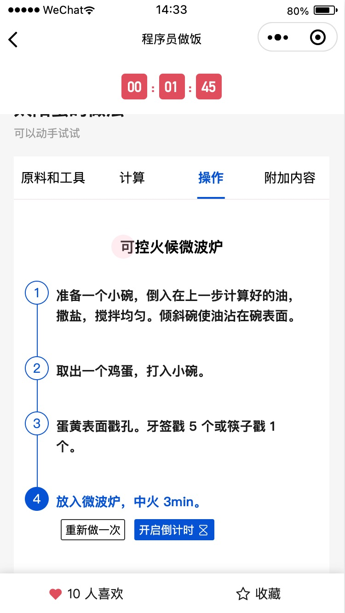
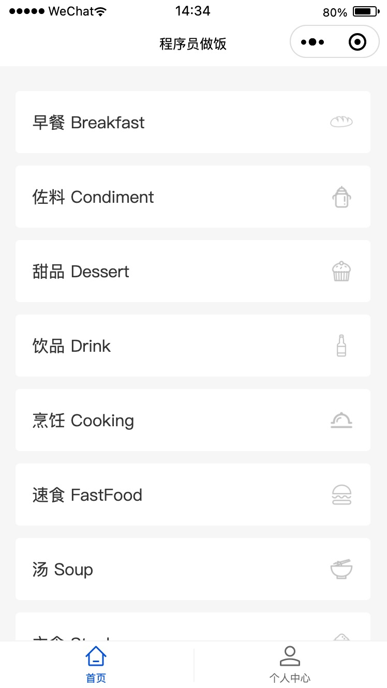
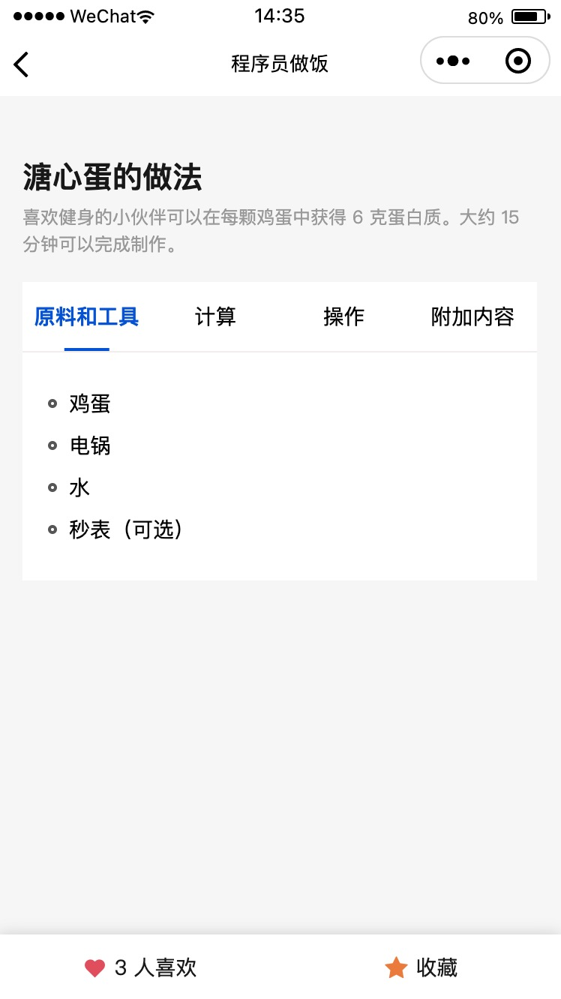
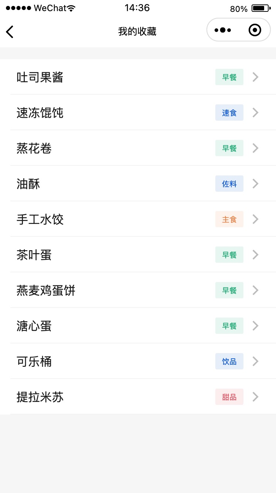

# HowToCookOnMiniprogram

小程序版本 **程序员做菜指南**，将程序员精神贯彻到底

灵感和数据来源于 [HowToCook](https://github.com/Anduin2017/HowToCook)


## 微创新

### 内嵌计时器 ⌛️

有些步骤会存在计时的需求，当前做到识别时间，并可以内嵌计时器



### 可视化分类 😊

简洁、美观



### 收藏 & 点赞 👍

方便快速找回常用的菜谱

<p>


</p>

### 图片 & 链接 🔗

支持图片预览、链接跳转

> 目前外部链接仅支持复制链接地址


### 直达买菜 🛒

收集了许多常用的买菜小程序，一键直达


## 如何贡献

### 启动

1. `cd miniprogram`
2. `npm install`
3. 开发者工具，点击菜单“工具 - 构建 npm”

### 小程序

源代码位于 miniprogram 目录

### 云开发

源代码位于 cloudfunctions 目录

### 数据解析

- 解析 markdown 菜谱的脚本位于 `srcipt/index.js`
- 对应命令: `npm run gen-data`

由于需要使用云开发 API 来上传图片，因此需要在根目录创建 `config.js`，提供如下配置：

```js
module.exports = {
  appid: 'wx01462be634a0d447', // appid
  secret: '', // 小程序 secret；在微信公众平台获取
  cloudEnvId: '' // 云开发环境
}
```

## 后续更新

### v1.0.0

- [x] 增加个人收藏 `v0.2.0`
- [x] 解析并展示 MarkDown 的图片、链接和各种格式 `v0.4.0`
- [x] 增加【学习】模块 `v0.5.0`
- [x] 发送订阅消息 `v1.0.0`
- [x] 增加【买菜】模块 `v1.0.0`

### v2.0.0

- [x] 支持搜索 `v1.1.0`
- [ ] 支持个人分享 （可能受限个人小程序无法做到）

## 补充

组件库使用的是 [TDesign Miniprogram](https://github.com/Tencent/tdesign-miniprogram)

如果你觉得还不错的话，希望可以点个 star。感恩 🙏🙏
